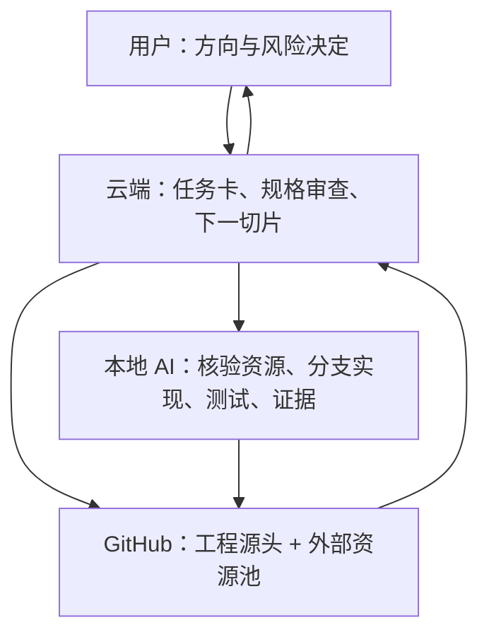

# Furina-Code 初循环实现阶段总路线 V0.1

> **文档状态**：实现路线稿；以已冻结的 P4《初循环权威与接口冻结规范 V0.1》为工程边界。  
> **适用范围**：Furina-Code 新仓库的初循环实现。  
> **工程分工前提**：本地 AI 可以连接 GitHub，并能在真实仓库中读取、修改、测试、提交、推送、检索和评估外部开源资源。

---

## 0. 结论：现在开始工程，但不是一次性“造完整 Furina Code”

云端设计阶段已经完成初循环的骨架：五系统、十九器官、五组织、对象权威、状态机、协议与 Gate 都已定义。

接下来正确的路线是：

> **把冻结契约压缩为一条小而真实的纵向闭环 → 本地 AI 在 GitHub 检索并引入合适的成熟能力，在分支实现 → 以提交、来源、测试和运行证据回传 → 云端只根据真实结果修正下一切片。**

不能按 `I1 全部做完 → I2 全部做完 → …` 横向建设。那会再次产生孤岛，且很久都无法判断 Furina Code 是否真的活着。

初循环实现应依次获得四种能力：

1. **可持续记录**：任务、项目、事件和检查点不会因后端/进程消失而丢失；
2. **可真实观察**：系统知道仓库事实，而不是只保存模型叙述；
3. **可受控改变**：一次小的真实写入经过授权、收据和对账；
4. **可证明成长**：中断后能恢复；第二轮只把经验作为建议重新验证。

---

## 1. 云端、本地 AI、GitHub 与用户的固定分工

| 角色 | 负责什么 | 不负责什么 |
| --- | --- | --- |
| 用户 | 给方向、确认需要人为决定的风险、体验真实成效。 | 不需要管理文件、命令、分支或测试细节。 |
| 云端 Furina Code 设计层 | 维护 P2–P4 宪法；查询 GitHub 与官方资料；为每个实现切片给出外部资源蓝图和权威边界；写任务卡、审查证据、形成版本化修订。 | 不把抽象设计伪装成已实现；不直接替代本地工程执行。 |
| 本地 AI | 在本地/分支上实现任务卡；核验云端指定资源的版本、许可证、兼容性和实际可用性；完成封装、测试、提交和推送证据。 | 不得自行改变 P4 权威边界、扩大任务范围、静默替换资源、无审计地复制外部代码或直接宣布产品成立。 |
| GitHub | 一方面是 Furina-Code 代码、冻结文档、提交和测试结果的真实工程源头；另一方面是云端设计层查询、由本地 AI 核验的外部能力资源池。 | 不是用户主权、项目现实或完成裁决本身；GitHub 上的代码也不因存在而自动可信或可引入。 |

### 1.1 协作方向



用户只需要看到关键结果：本轮实现了什么、证据是否足够、有哪些真实缺口、下一步准备做什么。复杂分支、命令和调试由本地 AI 与云端内部消化。

---

## 2. 实现阶段不变原则

1. **契约先于便利代码**：任何实现都必须服从 P4 的 OWNER、版本、票据、Gate 和未知副作用规则。
2. **纵向切片先于器官全量**：每轮都必须从用户/任务一路走到事实、证据和结果，哪怕能力很小。
3. **先只读，后写入；先受控写入，后扩大自治**：项目现实未稳定前，不让系统直接改真实仓库。
4. **测试与证据是产物**：本地 AI 交付的不只是代码，也包括测试命令、结果、提交 SHA、差异、Gate 结果和已知缺口。
5. **分支隔离**：本地 AI 只在任务分支修改；不直接向 `main` 写入。合并策略由后续仓库治理决定。
6. **失败必须留下状态**：测试失败、动作未知、恢复失败、后端不可用都应成为正式可见结果，而不是被重试掩盖。
7. **GitHub HEAD 优先**：讨论、旧文档或本地记忆与仓库当前提交冲突时，以可核查 HEAD 为工程事实。
8. **外部能力优先复用，生命权威必须本地拥有**：能借用成熟实现的，不从零重复制造；用户意图、正式对象、Gate、证据和完成裁决必须由 Furina Code 本地契约掌握。
9. **引用前审查，接入后封装**：任何 GitHub 资源必须先做来源、许可证、维护、安全和适配评估，再通过 P4 端口进入，禁止整套外部架构无边界搬入。

---

## 3. 总路线：从 P5 到 P8 的九个实现阶段

| 阶段 | 对应 P 阶段 | 云端设计 → 本地 AI 执行 | 阶段产物 | 通过标准 |
| --- | --- | --- | --- | --- |
| `E0 工程接棒` | P5 前置 | 将 P2–P4 冻结稿和仓库现状对齐，建立可重复开发/测试基线。 | 仓库状态快照、文档入口、测试基线、忽略规则。 | 能定位准确 HEAD；本地运行测试/静态检查；运行数据不进入 Git。 |
| `E1 首条闭环任务卡` | P5 | 选择一项小、真实、低风险、可恢复的首个任务族，并映射 P4 对象/协议/Gate。 | `P5 首条纵向闭环任务卡`。 | 任务有明确成功条件、写入边界、恢复点和第二轮对应任务。 |
| `E2 云端资源蓝图与本地核验接入设计` | P6 | 云端查询 GitHub/官方资料并指定候选与边界 → 本地 AI 核验真实版本、许可证、兼容性，再完成端口封装设计。 | `P6 能力来源矩阵`、云端资源蓝图、资源引入卡、ADR、可替换端口。 | 每项有设计来源与实际固定版本、许可证、替代/降级方案，且没有外部组件获得正式权威。 |
| `E3 生命脊柱与受控资源集成` | P7-A | 实现最小正式对象、事件、版本、TaskRun 双轴状态和契约测试；将 E2 选中的成熟能力封装在端口之后。 | O1/O2/O4 的最小代码、适配器封装与契约测试。 | 能创建 RunBinding、TaskDossier、TaskRun、事件、检查点；冲突/越权被拒绝；外部库不能绕过 OWNER。 |
| `E4 只读真实闭环` | P7-B | 接入真实 Git/文件观察与后端候选；不改变目标仓库。 | `inspect`/只读运行命令、快照、候选、验证/完成报告。 | 可对真实仓库完成 G0、G1、G2、G4、G6、G7 的只读路径。 |
| `E5 单次受控写入闭环` | P7-C | 在受控项目上执行一次小写入，完整经过计划、票据、执行、收据与对账。 | 动作执行器、Gate、对账和写入场景测试。 | G3/G5 成立；无票据、快照漂移和重复动作均被拒绝。 |
| `E6 强制中断与恢复` | P8-A | 在动作前、动作中、动作后等关键点故意中断，重启后运行恢复审查。 | 恢复场景、检查点、RecoveryVerdict、故障证据。 | G8 成立；未知副作用不被自动重试。 |
| `E7 第二轮经验验证` | P8-B | 用相似新任务调用经验建议，再完整通过现实/授权/验证链。 | 经验候选、匹配、试用记录和第二轮证据。 | G9 成立；经验不可用时能无经验降级运行。 |
| `E8 扩展与产品化` | P8 后 | 根据真实证据扩大任务族、工具范围和自治级别。 | 版本化能力路线、回归测试、能力现实账本。 | 每次扩大都有新的 Gate、反例和回退方案。 |

`E3–E7` 才是实际代码实现与验证主线；`E1/E2` 是为了让本地 AI 第一次写的代码既不从零重复造轮子，也不把外部项目误当 Furina Code 本体。

---

## 4. E0：工程接棒，不重建旧仓库

本地 AI 的第一张执行卡只做以下事情：

1. 克隆/更新 `Furina-Code`，记录分支、HEAD、远程地址和工作树状态；
2. 将 P2、P3、P4 正式稿放入 `docs/architecture/` 或已约定的文档目录，并在 README 建立入口；
3. 建立最小开发基线：语言版本、依赖安装、测试命令、静态检查命令、CI 入口；
4. 建立 `.gitignore`：运行状态、检查点、证据原件、密钥、缓存、构建物默认不提交；
5. 输出“仓库真实状态报告”，不编写 Furina Code 业务功能。

E0 的意义是把“云端冻结稿”真正放进工程源头，并让之后每张任务卡都能引用具体提交。

---

## 5. E1：P5 首条纵向闭环任务卡

### 5.1 首条任务应满足的条件

首条闭环不是任选一个 Demo。它必须：

- 发生在一个真实 Git 仓库中；
- 目标小、范围清楚、成功条件可测试；
- 至少包含一次项目观察和一次验证；
- 写入时只影响少量、可审查、可回滚的文件；
- 可以在至少两个位置插入中断；
- 能设计出一项相似但不相同的第二轮任务；
- 不涉及密钥、生产部署、删除、支付、外部账号写入或不可逆网络操作。

### 5.2 推荐的首条任务族

建议先用 **“Furina-Code 仓库自身的受控文档/配置/测试夹具更新”** 作为首条写入任务族。

原因：它是真实仓库变更，可在 Git 中完整对账；风险小；可以验证文件改动、测试/格式检查和恢复；不会一开始就让 Furina Code 改用户的重要项目代码。

推荐顺序：

1. `M1 只读`：读取 Furina-Code 仓库，生成“当前结构/测试基线报告”；
2. `M2 单写`：在专门的测试夹具或低风险文档中完成一个明确小修改，并验证差异；
3. `M3 恢复`：在动作收据已写、对账未写等位置强制中断；
4. `M4 第二轮`：完成一项相似的夹具/文档更新，试用第一轮经验建议。

这不是把夹具成功伪装成产品能力。它是用受控现实先证明生命闭环；之后 E8 再逐步进入普通代码文件和真实用户项目。

### 5.3 E1 任务卡必须写清的内容

| 区域 | 必填内容 |
| --- | --- |
| 用户目标 | 原始方向、明确成功条件、不可做事项。 |
| 项目边界 | 仓库、分支、允许文件、禁止文件、允许工具类别。 |
| P4 映射 | 本轮要用到的对象、状态转换、协议和 IL Gate。 |
| 行动边界 | 是否只读；若写入，最大文件数/路径范围/回滚或补偿方式。 |
| 验证 | 精确测试/检查命令、预期结果、失败如何记录。 |
| 中断点 | 至少两个可重现中断点及恢复预期。 |
| 第二轮 | 相似但不相同的任务，以及经验应只能影响什么。 |
| Git 边界 | 分支名、允许提交内容、禁止直接修改 main、提交/推送规则。 |

---

## 6. E2：云端资源蓝图与本地核验接入设计

E2 的目的不是让本地 AI 临场“挑技术栈”。正确顺序是：云端设计层根据 E1 的具体能力缺口，先查询 GitHub 与官方资料，提出可复用的成熟器官材料和边界；本地 AI 再对这些指定资源做真实可用性核验并接入。

### 6.1 每项能力都走同一条资源引入环

`云端能力缺口定义 → 云端 GitHub/官方资料研究 → 云端资源蓝图 → 本地版本/许可证/兼容性核验 → P4 边界适配 → 契约测试 → 进入实现切片`

云端资源蓝图至少给出两条可行路径：直接依赖、受控封装的 CLI/服务、少量受许可代码借用、仅借鉴设计后自行实现。本地 AI 不需要从零重新做架构判断；它只负责验证候选在真实仓库里是否成立，并报告差异。

### 6.2 云端与本地 AI 的交接

| 步骤 | 云端设计层 | 本地 AI |
| --- | --- | --- |
| 发现 | 从器官/端口缺口出发查询 GitHub、官方文档和许可证信息。 | 不做静默架构替换。 |
| 决策 | 给出推荐资源、备选、借用范围、权威禁令和接入方式。 | 检查资源是否仍存在、版本是否可解析、许可证/依赖是否与仓库现实兼容。 |
| 接入 | 定义本地端口、输入输出、失败降级和验收测试。 | 在分支封装、锁定版本、运行测试、记录真实差异。 |
| 例外 | 收到 `RESOURCE_EXCEPTION` 后重新研究或修改蓝图。 | 候选不可用/不兼容/风险不明时停止该资源接入，提交异常报告而不是自行换一个。 |

`RESOURCE_EXCEPTION` 必须至少包含：指定资源、实际版本/许可证/兼容问题、已运行的核验、影响的 P4 端口、可行备选和是否阻塞当前切片。

### 6.3 E1 所需能力与云端 GitHub 检索方向

| 能力缺口 | GitHub 可检索的资源类型 | Furina Code 必须自己保留 |
| --- | --- | --- |
| 本地正式状态 | 嵌入式状态库、事件日志、迁移/事务工具。 | OWNER、revision、事件语义、检查点与恢复裁决。 |
| 状态/协议验证 | schema/类型/状态机验证器。 | P4 的对象语义、非法转换和 Gate 断言。 |
| 项目观察 | Git 封装、文件树/差异解析、测试运行器。 | ProjectSnapshot 范围、盲区、现实判断和对账结论。 |
| 受控执行 | 命令运行器、沙箱、补丁/文件操作封装。 | AuthorizationTicket、执行强制、幂等键、ActionReceipt 与恢复决定。 |
| 后端端口 | 模型 SDK、MCP 客户端、结构化输出/工具调用适配器。 | ContextEnvelope、披露限制、CandidateEnvelope、任务权威。 |
| 策略与证据 | 策略引擎、溯源/签名、日志关联、测试报告解析。 | 用户授权来源、完成裁决、证据充分性和风险陈述。 |
| 经验存取 | 条件检索、索引、向量/文本存储。 | 经验适用性、试用记录、晋升/降级和“只建议”边界。 |

### 6.4 云端资源蓝图与资源引入卡（强制产物）

每个计划接入的 GitHub 资源都必须有一张引入卡：

| 项目 | 必填内容 |
| --- | --- |
| 来源 | 云端研究引用的仓库 URL、推荐 commit/tag/release、维护者/活跃度观察日期；本地 AI 核验的实际解析版本。 |
| 用途 | 填补哪个 P2 器官、P3 组织能力或 P4 端口。 |
| 引入方式 | `dependency`、`wrapped_tool`、`fork/vendor`、`reference_only` 四选一。 |
| 许可证 | 许可证类型、与 Furina-Code 预期发布方式的兼容判断、必须保留的声明。 |
| 安全与质量 | 已知风险、依赖面、凭证/网络/文件权限、测试状态和维护风险。 |
| 权威禁令 | 它绝不能写入/决定的 Furina Code 正式对象和 Gate。 |
| 适配面 | 本地端口、输入/输出映射、异常/超时/降级方式。 |
| 替代与退出 | 替代资源、移除/迁移成本、被弃用后的降级方案。 |
| 验收 | 要通过的契约测试、集成测试和真实闭环证据。 |

### 6.5 四种引入方式的默认顺序

1. `dependency`：优先用于成熟、维护良好、许可证兼容的底层能力；版本必须锁定。
2. `wrapped_tool`：适用于 Git、测试、沙箱等外部工具；通过 O3 端口调用，不将工具状态当正式状态。
3. `fork/vendor`：仅在必须修复、离线、强定制或上游不满足时使用；必须保留上游来源、差异和更新策略。
4. `reference_only`：只吸收设计/测试方法，Furina Code 自己实现最小契约；适用于权威、Gate、完成语义等核心生命逻辑。

完整 Agent 框架、外部持久记忆、自动执行器或黑盒工作流不能直接成为 Furina Code 内核；最多作为 O3 受控后端能力，或作为 E2 的比较样本。

E2 的输出不再只是“端口 + 选择理由”，而是：**云端能力来源矩阵 + 云端资源蓝图 + 资源引入卡 + ADR + 端口适配设计 + 替代/降级方案**。云端负责 GitHub 研究和物种级判断；本地 AI 负责真实仓库核验、封装与证据。

---

## 7. E3–E7 的最小实现顺序

### E3：先实现生命脊柱

先写最少但硬的本地能力：

`RunBinding → TaskDossier → TaskRun → CanonicalMeta → EventEnvelope → revision 冲突 → Checkpoint`

首批测试必须证明：

- 非 OWNER 无法写对象；
- `expected_revision` 不匹配会拒绝；
- 对象修订和事件不会只写一半；
- 重启后可重建 ContinuityView；
- 运行数据不会被误提交到 Git。

此阶段可以使用假后端和假项目观察器，只用于契约测试；不能称为真实闭环。

E3 优先复用 E2 已审查的事务、schema 或状态机底层能力，但 `RunBinding`、OWNER 检查、revision、EventEnvelope、Gate 和恢复裁决必须保留在 Furina Code 自己的领域代码中。

### E4：再实现只读真实闭环

接入真实 Git/文件观察，并通过真实后端端口生成候选，但不写项目文件：

`RunBinding → TaskDossier → ProjectSnapshot → ContextEnvelope → CandidateEnvelope → VerificationPlan → VerificationVerdict → CompletionVerdict`

只读完成裁决可以是“已完成观察报告”或“未完成的分析任务”，但必须诚实说明没有执行写入。E4 用来验证本地持续状态、后端可替换、现实观察和证据链是否真的能协作。

### E5：加入单次受控写入

只在受控测试夹具或明确低风险路径上启用：

`BoundActionPlan → AuthorizationDecision → AuthorizationTicket → EnforcementVerdict → ActionReceipt → RealityReconciliation → Verification → Completion`

本阶段最重要的不是改动复杂，而是证明：

- 没有票据不能写；
- 快照漂移后旧计划不能写；
- 同一幂等键不会重复写；
- 命令退出成功不等于任务完成；
- 写入后的现实差异和验证结果进入同一证据包。

### E6：故意打断系统

必须至少测试三类中断：

| 中断点 | 重启后的正确行为 |
| --- | --- |
| 写入前，票据已签发 | 检查票据/快照仍有效后才可继续；否则重新判断。 |
| 写入调用中，结果未知 | 禁止自动重试；查询 ActionReceipt、重新观察，再由 RecoveryVerdict 决定。 |
| 写入后，对账/验证前 | 读取已存在收据和当前差异，跳过重复写入，继续对账/验证或暂停。 |

### E7：第二轮经验验证

第一轮结束只能产生 `ExperienceCandidate`。第二轮任务必须：

1. 与第一轮相似但存在至少一项真实差异；
2. 由 O5 给出“为什么可能适用、什么情况下不适用”的建议；
3. 仍重新执行观察、授权、行动和验证；
4. 依据结果将经验标为 conditional、reusable、degraded 或 frozen。

---

## 8. 本地 AI 的标准任务卡与交付包

### 8.1 单张任务卡原则

一张任务卡只允许一个可审查目标。它可以增加多个文件，但不得同时：重构架构、换技术栈、补多个器官、修无关问题和扩大授权范围。

### 8.2 任务卡模板

```markdown
# 任务卡：<编号 + 名称>

## 目标
<用户效果与明确成功条件>

## 依据
<P2/P3/P4 文件与具体对象、协议、Gate>

## 允许范围
<仓库、分支、路径、工具、动作、最大风险>

## 明确禁止
<main 直写、密钥、无关重构、删除、网络写入等>

## 实现切片
<本轮必须实现的对象/协议/状态转换；明确不实现什么>

## 外部资源引入
<云端资源蓝图/引入卡引用、推荐版本、引入方式、许可证、权威禁令、替代方案；本地 AI 核验项；无资源时明确写“无”>

## 验证与证据
<命令、预期输出、需要保存的快照/收据/Gate 结果>

## 中断与失败处理
<模拟点、预期 RecoveryVerdict、停止条件>

## Git 交付
<分支、提交范围、推送/PR 规则、回传 HEAD>
```

### 8.3 本地 AI 每轮必须回传的证据包

| 类别 | 最低内容 |
| --- | --- |
| 工程定位 | 仓库 URL/名称、分支、开始/结束 HEAD、工作树是否干净。 |
| 变更事实 | 文件清单、关键差异摘要、提交 SHA。 |
| 外部资源事实 | 云端引入卡、实际解析版本、许可证、封装端口、锁定文件差异，以及任何 `RESOURCE_EXCEPTION`。 |
| 验证事实 | 实际运行命令、退出结果、测试/静态检查输出摘要。 |
| P4 证据 | 本轮对象/事件、协议调用、Gate 结果、未知项和拒绝项。 |
| 恢复事实 | 若本轮涉及写入，至少一个中断/恢复结果或明确说明尚未进入 E6。 |
| 诚实缺口 | 未实现项、失败项、环境限制、不能据此声称的能力。 |

云端只基于这份证据包与 GitHub HEAD 判断下一步，不依据“本地 AI 说已经好了”。

---

## 9. GitHub 分支与反馈闭环

### 9.1 最小分支规则

| 分支类型 | 用途 | 规则 |
| --- | --- | --- |
| `main` | 经验证的整合主线。 | 本地 AI 不直接写入。 |
| `feat/il-<编号>-<短名>` | 一张任务卡的一次实现。 | 只包含任务卡允许内容。 |
| `fix/il-<编号>-<短名>` | 修复已发现的契约/实现问题。 | 必须引用失败证据和受影响 P4 条目。 |
| `experiment/il-<短名>` | P6 选型或非确定性实验。 | 不以实验成功声称能力；不直接合入主线。 |

### 9.2 外部资源入库规则

- 依赖版本、上游 commit/tag 与许可证声明必须进入仓库可审查记录；
- 不默认使用 Git submodule 或整仓复制；只有引入卡证明必要时才使用；
- 外部资源只能由对应组织的适配层调用，禁止在多个目录直接散用；
- 上游不可用、许可证不清、维护停滞或安全风险无法解释时，不得进入主线；
- 外部资源升级视为一张独立任务卡，必须重新运行受影响的契约、恢复和 Gate 测试。

### 9.3 每轮闭环

`任务卡冻结 → 本地 AI 分支实现 → 自动/手动测试 → 提交与证据包 → GitHub HEAD → 云端审查 → 合入/返工/修订契约 → 下一任务卡`

如果真实实现发现 P4 不能表达必要情况，流程不是“本地 AI 先改代码”，而是：保留失败证据 → 云端定位冲突 → 形成版本化 P4 修订 → 再执行实现任务。

---

## 10. 阶段完成门与停止条件

| 阶段 | 可以进入下一阶段的最低条件 | 必须停止并回到设计/修复的信号 |
| --- | --- | --- |
| E0 → E1 | GitHub HEAD、文档入口、测试命令、运行数据忽略规则明确。 | 仓库状态不明、不能重复测试、冻结稿与仓库脱节。 |
| E1 → E2 | 任务有小范围、真实成功条件、写入边界、中断点、第二轮任务。 | 任务只是 Demo、目标过大、无法验证或无法恢复。 |
| E2 → E3 | 每项外部能力都有云端资源蓝图、GitHub 来源固定版本、引入卡、许可证/安全判断、端口、替代方案和权威禁令。 | 来源/许可证不清，或某个框架/SDK 需要直接写正式状态、绕过 Gate、成为任务/完成真相。 |
| E3 → E4 | 契约、版本冲突、对象 OWNER、事件和检查点测试通过。 | 可通过数据库/框架绕过 OWNER，或重启后任务不连续。 |
| E4 → E5 | 对真实仓库只读观察、候选、验证和诚实报告可复现。 | 后端候选被当作事实，快照范围/盲区不清。 |
| E5 → E6 | 单写动作完整留下计划、票据、收据、对账和验证。 | 重复写、无票据写、漂移写、命令成功即完成。 |
| E6 → E7 | 三类中断均有安全恢复或人工介入结论。 | 未知副作用自动重试，或恢复后重复执行写入。 |
| E7 → E8 | 经验第二轮有受控调用、真实结果和可降级记录。 | 经验直接驱动行动、授权或完成。 |

---

## 11. 实现阶段的最终形态

初循环不是在 E3 代码跑起来时成立，也不是在 E5 成功改一次文件时成立。它至少要在 E7 后，才能对外诚实地说：

> Furina Code 已在有限范围内完成一次真实开发闭环，能够保存本地连续性、观察项目现实、在授权下进行受控改变、以证据裁决完成、经中断审查恢复，并在第二轮任务中受控地试用经验。

这个声明仍然只适用于已验证的任务族、工具范围和风险等级；它不等于成熟版 Furina Code，也不等于可以自行处理任意项目。

---

## 12. 现在的唯一下一步

先产出并交给本地 AI 执行：

> **《P5 首条最小纵向闭环任务卡 V0.1》**

该任务卡应以 `E0 工程接棒 + E1 首条闭环选择` 为首个小批次，并明确需要云端在 E2 查询 GitHub 的能力缺口。之后由云端交付资源蓝图，本地 AI 核验并接入，再开始 E3 的真实代码实现。
