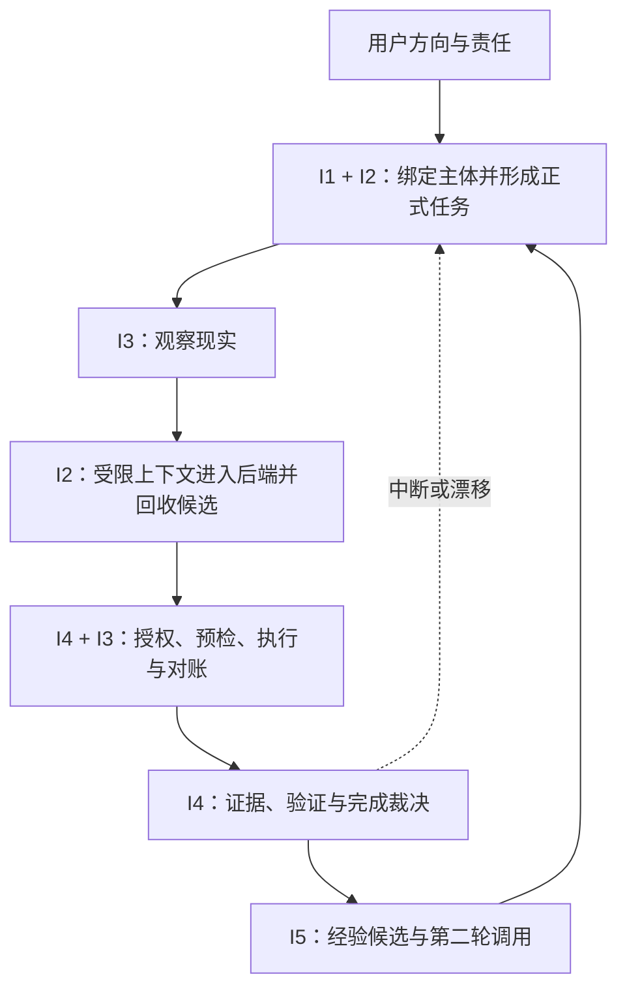

# Furina-Code 初循环工程基线与五系统器官候选总图 V0.1

> **文档状态**：P2 重做完成稿；待项目评审确认后，作为 P3 组织层抽取的唯一直接输入。  
> **研究日期**：2026-07-11。  
> **上位依据**：已冻结的《Furina Code 初循环版总设计 V0.2》与《Furina Code 成熟版总设计 V0.2》。  
> **真实性声明**：本文是候选级工程设计，不代表任何器官已实现、任何外部资源已选型、任何 Gate 已通过。

---

## 0. P2 的正确定位

P2 不是闭门列一张器官清单，也不是提前挑库。它同时进行两条工作，并在最后合流：

1. **内部推导**：从初循环必须维持的生命状态、责任链和 P1 证据目标，推导所需器官；
2. **外部对照**：把成熟工作流、状态机、权限、软件现实、证据谱系和经验学习范式当作“其他物种样本”，提取可借鉴原则、识别冲突并压力测试内部候选；
3. **合流裁决**：保留能服务 Furina Code 物种定义的原则，替换与用户主权、本地持续性和真实性冲突的原始逻辑；
4. **延迟选型**：P2 只形成外部能力候选和适配要求，具体库、框架、协议与实现到 P6 再决定。

因此本图回答四个问题：初循环要长出哪些责任器官；每个器官拥有什么正式对象；外部成熟范式改变了哪些内部设计；哪些共享需求应交给 P3 判断是否形成组织。

---

## 1. P0/P1 对 P2 的硬边界

### 1.1 初循环运行画像

| 项目 | 初循环基线 |
| --- | --- |
| 用户关系 | 一位明确用户是方向、意义和责任对象；用户不是可替换的内部组件。 |
| 项目范围 | 一个本地工作区/仓库、一项有界任务、受限工具集；暂不以多用户、多项目、云端自治为成立条件。 |
| 工程主体 | **可替换的外置后端能力 × 本地持续生命操作系统**；二者在同一闭环中耦合，但正式生命状态必须留在本地。 |
| 后端角色 | 提供理解、推理、计划、代码和工具调用候选；后端会话、模型和供应商都可更换。 |
| 行动范围 | 先覆盖读取、观察、受控修改、测试/检查及 Git 事实采集；越权或高风险动作停在拒绝、提案或用户介入。 |
| 连续性标准 | 进程崩溃、后端断连或会话清空后，能依据本地记录与重新观察判断继续、暂停、恢复或人工介入。 |
| 完成标准 | 不是后端声称完成，而是任务条件、授权、实际差异、验证和残余缺口共同支持完成裁决。 |
| 经验标准 | 第一轮形成可审查经验候选；第二轮相似任务验证调用价值。单次成功不自动晋升为肌肉记忆。 |

### 1.2 七条工程不变量

1. **用户主权不外包**：后端、工具、策略引擎和经验都不能替用户扩大目标或权限。
2. **项目现实不由语言决定**：文件、Git、命令结果和验证事实优先于模型叙述。
3. **正式对象单一权威**：每类正式对象只有一个拥有者；其他系统通过事件或请求协作。
4. **策略判断与行动强制分离**：能否做与实际执行不是同一个动作，也不能由同一条模型输出同时完成。
5. **恢复不能盲目重放副作用**：恢复必须先核对动作收据和当前现实，再决定跳过、补偿、重试或人工介入。
6. **日志不自动等于证据**：证据必须有来源、对象、时间、关联关系和验证语义；数量不能代替充分性。
7. **经验不得静默改变权威状态**：经验只能产生建议和候选，不能直接写任务、授权、项目事实或完成结论。

---

## 2. 外部范式对照结论

### 2.1 P2 使用的外部样本

| 外部范式/资料 | 可借鉴原则 | 不能照搬的原始逻辑 | 对 P2 的直接修正 |
| --- | --- | --- | --- |
| [Temporal Event History 与恢复](https://docs.temporal.io/workflow-execution/event) | 追加式事件历史可用于崩溃恢复和审计；工作流决定与外部副作用应分离。 | Furina Code 不能把工作流框架的重放结果直接当项目现实，也不能默认所有动作都可重试。 | I1 保留连续历史；I3 新增动作预检、幂等键/收据和恢复前现实对账。 |
| [LangGraph 持久化与 Interrupt](https://docs.langchain.com/oss/python/langgraph/interrupts) | 检查点、稳定运行标识和显式暂停/恢复能支撑 human-in-the-loop。 | 图状态或 thread id 不能充当 Furina Code 的持续自我；节点恢复也不能直接重放代码写入。 | I1 的恢复必须是“重新观察后裁决”，I2 编排状态不能独占生命状态。 |
| [W3C SCXML 状态机](https://www.w3.org/TR/scxml/) | 状态、事件、转换和进入/退出动作需要明确语义。 | 不直接采用其 XML 表达，也不让状态机语法替代任务意义与用户责任。 | I2 的任务生命周期和 I1 的恢复分类必须成为显式状态转换，后续 P4 冻结。 |
| [MCP 架构与工具规范](https://modelcontextprotocol.io/specification/2025-11-25/architecture) | Host 负责连接生命周期、安全边界、权限与用户授权；工具接口可标准化和隔离。 | MCP 工具是模型可发现/调用的能力，但协议本身不能成为授权与完成权威；协议会话也不是正式任务。 | I2 拆出后端能力登记、上下文封装和候选收件；I4 保留独立授权/强制 Gate。 |
| [Git status porcelain v2](https://git-scm.com/docs/git-status) 与 [git diff](https://git-scm.com/docs/git-diff) | 使用机器可解析的工作树状态、提交标识和差异作为项目观察基线。 | Git 只覆盖版本化事实，不能代表运行环境、未跟踪外部状态、测试结果或用户意图。 | I3 的“项目现实”定义为多源快照，Git 是其中一个事实提供者。 |
| [NIST ABAC](https://csrc.nist.gov/pubs/sp/800/162/upd2/final) | 授权应结合主体、对象、动作和环境条件，而不是只有一个静态“允许”。 | 企业级 ABAC 不应整体搬入初循环，也不能把用户主权降格为普通策略属性。 | I4 授权票据必须绑定任务版本、项目快照、动作、范围、时效与环境条件。 |
| [OPA 策略哲学](https://www.openpolicyagent.org/docs/philosophy) | 策略判断可与业务执行分离；上下文驱动决策。 | OPA 明确不是外部数据或策略事实的源头，因此不能拥有项目真相、用户授权来源或完成裁决。 | 原 I4-A 被拆成“策略/授权判断”与“执行前强制/撤权 Gate”。 |
| [SLSA Provenance](https://slsa.dev/spec/v1.2/provenance) 与 [in-toto 验证](https://in-toto.io/docs/getting-started/) | 证据要能说明对象从哪里来、何时及如何产生，并验证步骤、执行者、材料和产物。 | 签名和谱系只能证明来源/过程，不自动证明代码正确或满足用户目标。 | I4 将“证据谱系”“验证评价”“完成裁决”拆成三个责任器官。 |
| [OpenTelemetry 上下文传播](https://opentelemetry.io/docs/concepts/context-propagation/) | 跨器官事件需要稳定关联标识，才能把日志、动作和验证串成因果路径。 | 遥测主要用于可观测性，不能替代正式状态、授权票据或证据真实性。 | P3 必须检验“统一关联与谱系”是否应成为跨器官组织能力。 |
| [Reflexion](https://arxiv.org/html/2303.11366) | Actor、Evaluator、Reflection 和 Memory 分离；从反馈形成可解释文字经验。 | 论文也指出自我评价无正式成功保证，反思可能陷入局部最优。 | I5 不得自证经验正确，只能从 I4 已裁决证据中提炼候选，并保留反例和置信度。 |
| [ExpeL](https://arxiv.org/html/2308.10144v2) | 同时利用成功与失败经历、跨任务提取洞见、调用相似成功轨迹，并允许人工检查/删除。 | 不能把自然语言洞见直接当通用规则，也不能只以模型表现提升作为责任充分性。 | I5 保留经验池、适用条件、调用记录、晋升/降级，而不是单一“记忆库”。 |

### 2.2 外部对照带来的关键变化

相较第一次内部草图，P2 重做后发生了四项结构修正：

1. `I2` 将“后端适配”与“送给后端的上下文封装”拆开，避免适配器顺手取得全部本地状态；
2. `I3` 将“行动前预检”“副作用执行”“行动后对账”拆开，为重试、恢复和补偿留下真实边界；
3. `I4` 将“授权判断”与“执行强制”拆开，将“证据封装”“验证评价”“完成裁决”拆开；
4. `I5` 明确依赖 I4 的外部/项目反馈，不能依赖模型自我反思自行晋升经验。

---

## 3. 初循环五系统总图

| 系统 | 要维持的生命状态 | 正式责任 | 绝不能拥有的权力 |
| --- | --- | --- | --- |
| `I1 持续自我与恢复` | 主体与任务跨会话连续；中断后不盲目续跑。 | 运行绑定、连续性投影、检查点与恢复裁决。 | 用户方向、项目事实、完成裁决。 |
| `I2 任务与后端中介` | 用户方向不丢失；外置后端可换而正式任务不散。 | 任务档案、后端能力隔离、上下文包、候选与运行编排。 | 项目写入权、授权权、完成权。 |
| `I3 项目现实与受控行动` | 行动前后都能知道项目实际是什么。 | 多源观察、行动预检、副作用执行、行动收据与现实对账。 | 扩大目标/授权、验证自身成功。 |
| `I4 治理、证据与完成` | 行动不越权，结论不虚假，责任可追溯。 | 授权判断、强制 Gate、证据谱系、验证评价、完成裁决。 | 用户意图原文、行动候选、项目事实源。 |
| `I5 经验生长` | 成功与失败能留下有条件、可降级的经验。 | 经验候选、适用性检索、第二轮调用、晋升/降级。 | 直接行动、授权、改写任务或自证正确。 |

### 3.1 初循环运行链



这是一条责任链，不是五个独立产品。任何中断恢复都必须回到“本地检查点 + 当前项目重新观察 + 尚有效的授权”三者共同裁决。

---

## 4. 十九个器官候选

> “器官”是不可混淆的责任单元，不必一器官对应一个进程、类或目录。P3/P4 可以让多个器官共处一个实现模块，但不能合并它们的权威语义。

### 4.1 I1：持续自我与恢复（3 个）

| 编号与器官 | 最小职责 | 正式输出 | 关键失败与边界 | 初循环级别 |
| --- | --- | --- | --- | --- |
| `I1-A 主体—用户—项目绑定器` | 建立本次运行主体、用户、项目、任务与工具边界的可验证绑定。 | `RunBinding` | 绑定缺失、项目错位、用户不明时不得进入行动态。 | 必需 |
| `I1-B 连续性投影与生命状态账本` | 从各正式对象拥有者的事件生成当前生命状态投影，保存版本与因果位置。 | `ContinuityView`、`LifeEventCursor` | 它只拥有连续性投影，不反向取得任务、项目、授权等对象写权。 | 必需 |
| `I1-C 检查点与恢复裁决器` | 形成检查点；重启后比较旧状态、动作收据和新现实，裁决继续、暂停、补偿、重试或人工介入。 | `Checkpoint`、`RecoveryVerdict` | 不允许把“加载成功”当“可继续”；副作用未知时禁止自动重放。 | 必需 |

### 4.2 I2：任务与外置后端中介（4 个）

| 编号与器官 | 最小职责 | 正式输出 | 关键失败与边界 | 初循环级别 |
| --- | --- | --- | --- | --- |
| `I2-A 意图—任务档案器` | 保存用户原始方向引用，并登记范围、成功条件、未知项、风险与任务版本。 | `TaskDossier` | 推断内容必须与用户原意区分；歧义不能静默转成高风险目标。 | 必需 |
| `I2-B 后端能力登记与适配器` | 描述后端可用模型、上下文、工具/结构化输出能力及失效状态，隔离供应商差异。 | `BackendProfile`、`BackendSessionRef` | 后端会话不是任务身份；断连或替换不能丢正式任务。 | 必需 |
| `I2-C 上下文包构造与披露过滤器` | 按任务阶段、最小必要性和敏感边界，构造送往后端的版本化上下文包。 | `ContextEnvelope` | 不能默认把完整仓库、长期记忆、凭证或全部用户资料交给后端。 | 必需 |
| `I2-D 候选收件与任务运行编排器` | 接收带来源的理解/计划/代码/工具候选，驱动等待观察、审查、授权、行动、验证、暂停和恢复。 | `CandidateEnvelope`、`RunTransitionRequest` | 候选不是真相；编排器不能直接写项目、签授权或宣布完成。 | 必需 |

### 4.3 I3：项目现实与受控行动（4 个）

| 编号与器官 | 最小职责 | 正式输出 | 关键失败与边界 | 初循环级别 |
| --- | --- | --- | --- | --- |
| `I3-A 多源项目观察与快照器` | 采集文件、Git、环境、相关配置和验证前事实，标记观察范围与盲区。 | `ProjectSnapshot` | Git 不是全部现实；读取失败、脏工作区和未跟踪状态必须显式保留。 | 必需 |
| `I3-B 行动计划绑定与预检器` | 把候选动作绑定到任务版本、基线快照、目标对象、预期差异、风险、回滚/补偿与授权票据。 | `BoundActionPlan` | 基线漂移、输入不完整、无补偿路径的高风险动作必须拒绝或升级。 | 必需 |
| `I3-C 副作用执行与动作收据器` | 使用幂等键或等价防重机制执行一次受控副作用，记录开始、结果、退出状态和未知状态。 | `ActionReceipt` | 超时不等于失败、失败不等于未执行；未知结果不得盲目重试。 | 必需 |
| `I3-D 行动后再观察与现实对账器` | 重新观察并比较预期/实际差异，识别额外改变、缺失改变和环境漂移。 | `RealityReconciliation` | 命令返回 0 或补丁应用成功不能直接等价于任务成功。 | 必需 |

### 4.4 I4：治理、证据与完成（5 个）

| 编号与器官 | 最小职责 | 正式输出 | 关键失败与边界 | 初循环级别 |
| --- | --- | --- | --- | --- |
| `I4-A 策略与授权判断器` | 根据用户授权、主体、对象、动作、任务版本、环境与风险判断允许、拒绝或需要用户决定。 | `AuthorizationDecision` | 策略规则不能伪装成用户授权来源；判断器不执行动作。 | 必需 |
| `I4-B 执行强制、票据与撤权 Gate` | 将判断变成范围化、可过期、可撤销的票据，并在执行瞬间复核票据和现实条件。 | `AuthorizationTicket`、`EnforcementVerdict` | 票据过期、目标漂移或用户撤权后必须失效；执行器不能绕过 Gate。 | 必需 |
| `I4-C 证据谱系与关联封装器` | 用稳定关联标识连接任务、快照、候选、授权、动作、验证和产物，保留来源及完整性信息。 | `EvidenceEnvelope`、`ProvenanceGraph` | 遥测/日志可以成为材料，但未关联、不可解释的日志不是充分证据。 | 必需 |
| `I4-D 验证计划与证据评价器` | 从任务成功条件生成验证需求，请求 I3 执行必要检查，并评价覆盖、失败、未验证项和证据强度。 | `VerificationPlan`、`VerificationVerdict` | 不能由生成候选的同一后端自评后直接通过；签名/来源不等于正确性。 | 必需 |
| `I4-E 完成裁决器` | 综合任务、授权范围、现实对账和验证结论，裁决完成、部分完成、未完成或需人工决定。 | `CompletionVerdict` | 必须同时陈述已完成、未完成、未验证和残余风险；不得接受后端自报完成。 | 必需 |

### 4.5 I5：经验生长（3 个）

| 编号与器官 | 最小职责 | 正式输出 | 关键失败与边界 | 初循环级别 |
| --- | --- | --- | --- | --- |
| `I5-A 经验候选提炼器` | 从 I4 已裁决的成功/失败证据中提炼路径、条件、结果、反例和可操作提示。 | `ExperienceCandidate` | 自我反思只能作为材料；没有外部/项目反馈支撑时只能低置信保留。 | 第二环必需 |
| `I5-B 适用性检索与试用调用器` | 比较新任务与经验的项目、目标、环境、风险和失败信号，只把匹配经验作为可见建议送入 I2。 | `ExperienceMatch`、`TrialUseRecord` | 相似度不能替代条件核对；经验不得直接调用工具或扩大权限。 | 第二环必需 |
| `I5-C 晋升、降级与废止器` | 根据跨任务多轮证据、反例和用户修订，晋升、维持、降级或废止经验。 | `ExperienceLifecycleVerdict` | 初循环只实现最小人工/规则辅助晋升；单次成功不形成稳定肌肉记忆。 | 接口预留 |

---

## 5. 正式对象与唯一拥有者

| 正式对象 | 唯一拥有者 | 其他系统可以做什么 | 禁止跨写 |
| --- | --- | --- | --- |
| `RunBinding`、`ContinuityView`、`Checkpoint`、`RecoveryVerdict` | I1 | 提交事件、读取连续性和恢复结论 | 后端或编排器直接改写“已恢复”。 |
| 用户方向原文 | 用户 | I2 只保存引用、结构化副本和修订关系 | 把模型推断写成用户原意。 |
| `TaskDossier`、任务运行阶段 | I2 | I1 形成投影；I3/I4/I5 提交事实或请求 | I3 以执行结果关闭任务。 |
| `BackendProfile`、`ContextEnvelope`、`CandidateEnvelope` | I2 | I4 审计披露与候选边界 | 后端会话取得正式任务权威。 |
| `ProjectSnapshot`、`BoundActionPlan`、`ActionReceipt`、`RealityReconciliation` | I3 | I2/I4 读取、请求观察或执行 | 后端文本替代项目观察。 |
| 授权判断/票据、证据谱系、验证和完成裁决 | I4 | 其他系统提交材料并读取裁决 | I2/I3/I5 自行授权或宣布完成。 |
| 经验候选、匹配、试用记录和生命周期裁决 | I5 | I2 请求建议；I4 审计依据 | 经验直接改写任务、现实或授权。 |

重要修正：`I1-B` 维护的是跨对象的连续性**投影**，不是统一数据库中的全局写权；`I4-C` 维护的是证据**封装与谱系**，不是把 I3 的原始项目事实夺为己有。

---

## 6. IL-G0–IL-G9 的器官覆盖

| Gate | 要证明的问题 | 主责器官 | 最低证据 |
| --- | --- | --- | --- |
| `IL-G0 运行绑定` | 是否绑定正确用户、项目、任务和边界？ | I1-A + I2-A | `RunBinding`、任务版本、项目定位。 |
| `IL-G1 意图成案` | 用户方向是否被如实转成可审查任务？ | I2-A | 原意引用、成功条件、未知项、范围和修订历史。 |
| `IL-G2 现实充分` | 行动前观察是否覆盖本次风险需要？ | I3-A | 快照、Git/文件/环境事实、盲区说明。 |
| `IL-G3 授权有效` | 当前动作在当前现实下是否被允许且可撤权？ | I4-A + I4-B | 决策、票据、对象/动作/环境条件和复核结果。 |
| `IL-G4 候选受限` | 后端输入是否最小必要，输出是否仍是候选？ | I2-B/C/D | 后端档案、上下文包、候选来源与审查记录。 |
| `IL-G5 行动可对账` | 副作用是否防重、留收据并与现实对账？ | I3-B/C/D | 绑定计划、动作收据、前后快照与差异。 |
| `IL-G6 证据充分` | 验证是否覆盖成功条件并暴露失败/未知？ | I4-C/D | 谱系、验证计划、结果、覆盖与未验证项。 |
| `IL-G7 完成诚实` | 完成度和残余缺口是否被如实裁决？ | I4-E | 完成裁决、剩余风险和范围外项。 |
| `IL-G8 中断可恢复` | 中断后是否避免盲目重放并作出正确恢复分类？ | I1-C + I3-A/C/D + I4-B | 检查点、动作收据、新快照、票据复核和恢复裁决。 |
| `IL-G9 经验可控` | 第二轮是否在适用条件内调用经验并保留反例？ | I5-A/B + I4-D/E | 经验候选、匹配理由、试用记录、第二轮验证。 |

---

## 7. 外部能力候选矩阵（研究候选，不是 P6 选型）

| 能力位置 | P6 可评估候选 | P2 已确定的适配要求 | 永不授予的权力 |
| --- | --- | --- | --- |
| 本地正式状态 | SQLite 事务/WAL、追加式本地日志、嵌入式 KV | 崩溃一致性、版本冲突检测、备份恢复、可迁移；单机优先。 | 不由数据库自动决定对象权威或完成语义。 |
| 工作流/状态机 | 自建轻量状态机、SCXML 实现、LangGraph、Temporal | 显式转换、检查点、暂停/恢复、历史版本；副作用隔离。 | 不把框架运行状态当持续自我或项目现实。 |
| 后端与工具协议 | MCP、厂商 SDK 适配器、本地进程/HTTP 适配 | 能力发现、结构化契约、最小上下文、凭证隔离、可替换。 | 不直接取得正式状态写权、授权权和完成权。 |
| 对象契约 | JSON Schema 2020-12、语言类型系统/验证库 | 版本化、向后兼容、严格验证、未知字段策略。 | Schema 有效不等于语义真实。 |
| 项目事实 | Git CLI porcelain、libgit2/Dulwich、文件哈希与环境采集 | 机器可读、范围明确、前后快照、保留未跟踪与非 Git 现实。 | Git 不能代表用户目标或完整运行现实。 |
| 动作执行 | 受限子进程、沙箱、文件补丁、Git 操作封装 | 超时、取消、输出限制、幂等键、收据、补偿与未知状态。 | 不允许执行器自批授权或自报完成。 |
| 策略与权限 | 本地规则/能力票据、OPA/Rego、ABAC 风格判断 | 判断与强制分离；绑定主体/对象/动作/环境；撤权和过期。 | 策略引擎不是用户授权来源或项目真相。 |
| 证据与关联 | 本地内容寻址证据、in-toto/SLSA 模型、OpenTelemetry 关联字段 | 来源、时间、对象指纹、因果关联、脱敏、完整性与保留周期。 | 日志、签名或追踪不能单独裁决正确与完成。 |
| 经验存储与检索 | 结构化本地经验库、关键词/条件检索、后期向量检索 | 成功与失败并存、条件可见、来源可追、可编辑/删除、可降级。 | 相似检索不能触发工具、授权或自动晋升。 |

P6 必须为每项候选补齐：替换方案、故障降级、数据迁移、隐私边界、维护成本、许可证、离线可用性和最小验证任务。

---

## 8. P3 应从 P2 抽取的共享需求

P2 不直接创建组织，但已经产生了必须由 P3 审判的跨器官共享需求：

| 共享需求候选 | 来源器官 | 为什么可能需要组织化 | P3 必须防止的错误 |
| --- | --- | --- | --- |
| 统一对象标识、版本和因果关联 | I1-B、I2-A/D、I3、I4-C、I5 | 没有共同标识，恢复、证据和经验无法串成同一责任链。 | 建成拥有所有对象写权的“全局状态中台”。 |
| 正式事件与只读投影 | 五系统 | I1 连续性、I4 证据和 I5 经验都要读取跨系统事件。 | 把事件日志误当成完整项目现实或完成证据。 |
| 后端/工具适配边界 | I2-B/C、I3-C、I4-B | 后端、工具、凭证与权限需要统一隔离和失效处理。 | 让通用适配层绕过器官权威。 |
| 检查点、动作收据与恢复协定 | I1-C、I2-D、I3-C/D、I4-B | 恢复跨越编排、现实与授权，必须有共同协议。 | 采用“从最后一步重跑”的单一恢复策略。 |
| 证据关联、脱敏与保留 | I3、I4-C/D、I5 | 原始证据、可共享摘要和经验材料的生命周期不同。 | 把所有日志永久保存或把敏感内容送给后端。 |

只有当共享能力具有明确来源、唯一治理者、稳定接口，并且抽取后不会隐藏用户主权与裁决责任，P3 才能把它提升为组织。

---

## 9. 新仓库的候选映射

目录仍是逻辑候选，不承诺语言、框架或一器官一模块。

```text
Furina-Code/
├─ README.md
├─ docs/
│  ├─ architecture/       # 冻结总设计、P2 总图、后续组织层
│  ├─ contracts/          # P4 对象、状态机、事件、Gate 与接口宪章
│  ├─ decisions/          # 重要设计决定与替代方案
│  └─ evidence/           # 可共享证据索引和裁决摘要
├─ src/
│  ├─ continuity/         # I1
│  ├─ task_backend/       # I2
│  ├─ project_action/     # I3
│  ├─ governance/         # I4
│  ├─ experience/         # I5
│  └─ adapters/           # P6 后的外部能力封装；无正式权威
├─ runtime/
│  ├─ state/
│  ├─ checkpoints/
│  ├─ receipts/
│  ├─ evidence/
│  └─ experience/
└─ tests/
   ├─ contract/           # 单写、接口、拒绝越权
   ├─ scenario/           # 真实纵向闭环
   ├─ recovery/           # 崩溃、未知副作用、漂移恢复
   └─ adversarial/        # 越权候选、伪证据、错误经验
```

在 P3/P4 前不创建泛化 `shared` 中台。`adapters` 只能翻译协议、调用外部能力和报告结果，不能直接决定或写入正式对象。

---

## 10. P2 完成裁决

### 10.1 已完成

- P0/P1 的边界已经转化为器官级责任约束；
- I1–I5 已形成 **19 个责任器官候选**；
- 外部范式已逐项完成“提取—冲突—替换—修正”，不是只列参考链接；
- 每类正式对象已有唯一拥有者，跨写禁令已明确；
- 外部能力已形成 P6 候选矩阵，但没有提前锁定技术栈；
- P3 需要审判的五类共享需求已经从器官间真实依赖中产生。

### 10.2 仍未完成，因此不能声称

- 19 个责任器官尚未经过 P3 组织抽取与 P4 接口/状态机冻结；
- 任何框架、数据库、协议或库都尚未选型；
- 仓库中没有因此自动获得对应实现；
- `IL-G0–IL-G9` 尚未通过真实双轮任务验证；
- 本文完成只意味着 **P2 设计环节完成**，不意味着初循环工程成立。

### 10.3 唯一下一步

进入 `P3 组织自然抽取`：以十九个器官产生的对象、事件、恢复、适配和证据共享需求为依据，设计《Furina-Code 初循环组织层蓝图 V0.1》。P3 不得重新发明五系统，也不得让组织层夺走本文已经明确的正式对象权威。

---

## 参考资料

1. Temporal, [Events and Event History](https://docs.temporal.io/workflow-execution/event)；[Activity Definition](https://docs.temporal.io/activity-definition)。
2. LangChain, [LangGraph Interrupts](https://docs.langchain.com/oss/python/langgraph/interrupts)；[Persistence](https://docs.langchain.com/oss/python/langgraph/persistence)。
3. W3C, [State Chart XML (SCXML) 1.0](https://www.w3.org/TR/scxml/)。
4. Model Context Protocol, [Architecture](https://modelcontextprotocol.io/specification/2025-11-25/architecture)；[Tools](https://modelcontextprotocol.io/specification/2025-11-25/server/tools)；[Security Best Practices](https://modelcontextprotocol.io/docs/tutorials/security/security_best_practices)。
5. Git, [git-status](https://git-scm.com/docs/git-status)；[git-diff](https://git-scm.com/docs/git-diff)。
6. NIST, [SP 800-162: Guide to Attribute Based Access Control](https://csrc.nist.gov/pubs/sp/800/162/upd2/final)。
7. Open Policy Agent, [Philosophy](https://www.openpolicyagent.org/docs/philosophy)；[External Data](https://www.openpolicyagent.org/docs/external-data)。
8. SLSA, [Provenance v1.2](https://slsa.dev/spec/v1.2/provenance)；in-toto, [Getting Started and Verification](https://in-toto.io/docs/getting-started/)。
9. OpenTelemetry, [Context Propagation](https://opentelemetry.io/docs/concepts/context-propagation/)；[Logging Specification](https://opentelemetry.io/docs/specs/otel/logs/)。
10. Shinn et al., [Reflexion: Language Agents with Verbal Reinforcement Learning](https://arxiv.org/html/2303.11366)。
11. Zhao et al., [ExpeL: LLM Agents Are Experiential Learners](https://arxiv.org/html/2308.10144v2)。
12. SQLite, [Write-Ahead Logging](https://sqlite.org/wal.html)；JSON Schema, [Draft 2020-12](https://json-schema.org/draft/2020-12)。
