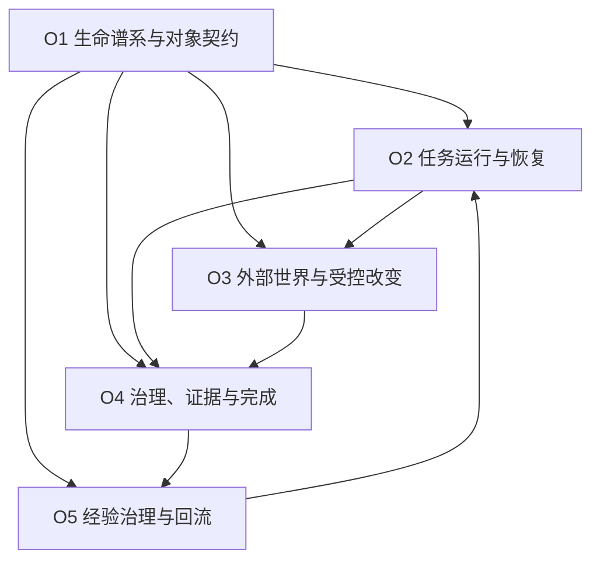

# Furina-Code 初循环组织层蓝图 V0.1

> **文档状态**：P3 组织自然抽取完成稿；待项目评审确认后，作为 P4 权威与接口冻结的直接输入。  
> **设计日期**：2026-07-11。  
> **唯一直接输入**：《Furina-Code 初循环工程基线与五系统器官候选总图 V0.1》（P2 重做完成稿）。  
> **真实性声明**：本文定义组织关系与边界，不代表组织、接口、状态机、存储或运行时已经实现。

---

## 0. P3 要解决的不是“再加一层模块”

P2 已经回答了 Furina Code 初循环需要哪些责任器官。P3 只回答：当这些器官必须共享对象、完成同一事务、共同恢复或互相制衡时，怎样形成稳定协作结构。

本文中：

- **系统**说明 Furina Code 必须维持哪一种生命责任；
- **器官**说明不可混淆的最小责任单元；
- **组织**说明多个器官如何围绕一种稳定共同事务协作；
- **基础设施**只是组织将来可能使用的技术，不是组织本身。

组织不能获得器官原本没有的权力，也不能把用户主权、项目现实或完成裁决藏进公共层。组织的价值是：形成共同契约、明确交接、隔离故障、阻止跨写，并使初循环能真实恢复。

---

## 1. 组织抽取方法与裁决标准

### 1.1 抽取方法

对十九个器官逐一检查四种关系：

1. **共享对象**：多个器官是否必须引用同一对象、版本、范围或因果链；
2. **共同事务**：多个器官是否必须共同完成一个不能被拆散的生命动作；
3. **共同故障域**：一个器官中断后，哪些器官必须一起判断未知、补偿、暂停或恢复；
4. **相互制衡**：哪些责任必须协作，但必须保持判断与执行、事实与评价、经验与授权分离。

只有同时满足“反复跨器官使用、存在稳定交接、能够明确治理者、抽取后不夺权”的候选，才成为组织。

### 1.2 组织成立标准

| 标准 | 必须满足的条件 |
| --- | --- |
| 真实共享 | 至少跨越两个器官，通常跨越两个以上系统；不是为了目录整齐而抽象。 |
| 稳定事务 | 围绕一种长期存在的事务，如连续谱系、任务恢复、受控改变、完成证明或经验回流。 |
| 明确边界 | 能说清输入、输出、唯一权威、拒绝条件与故障降级。 |
| 不夺权 | 正式对象仍由 P2 指定的器官拥有；组织只提供协作秩序。 |
| 可验证 | 后续能通过契约测试、恢复测试、越权测试或真实场景证明其作用。 |

---

## 2. 从 P2 共享需求到组织的裁决

| P2 共享需求 | P3 裁决 | 理由 |
| --- | --- | --- |
| 统一对象标识、版本和因果关联 | 与“正式事件及只读投影”合并为 `O1 生命谱系与对象契约组织` | 二者共同维护跨系统身份与可追溯性，拆开会产生两套标识和因果真相。 |
| 正式事件与只读投影 | 并入 O1 | 事件载体和连续性投影必须共享同一版本/因果语义，但不得共享对象写权。 |
| 检查点、动作收据与恢复协定 | 与任务档案及运行编排合并为 `O2 任务运行与恢复组织` | 恢复必须理解任务语义、当前阶段和未决副作用；独立恢复中台无法正确决定“接下来是什么”。 |
| 后端/工具适配边界 | 扩展为 `O3 外部世界与受控改变组织` | 后端、项目观察和工具行动都跨越本地生命边界，共享能力登记、披露、凭证、失效和结果回收要求。 |
| 证据关联、脱敏与保留 | 与授权、验证及完成合并为 `O4 治理、证据与完成组织` | 证据保存不能脱离“为什么允许、要证明什么、是否足以完成”的语义。 |
| 经验提炼、第二轮调用与晋升 | 成立为 `O5 经验治理与回流组织` | 它跨越 I4 的已裁决证据、I5 的经验生命周期和 I2 的新任务编排，且具有独立的降级语义。 |

### 2.1 被拒绝或合并的组织候选

| 候选 | 裁决 | 原因 |
| --- | --- | --- |
| 全局状态中台 | 拒绝 | 会把 I1 连续性投影误变成所有正式对象的写入者，破坏单一权威。 |
| 通用事件总线组织 | 拒绝独立成立 | 事件传递是 O1 的一种能力，不足以单独承担生命责任；“消息已送达”也不等于语义成立。 |
| 独立恢复中台 | 合并进 O2 | 恢复依赖任务语义、动作收据、项目新现实和授权复核，不能脱离运行组织。 |
| 独立证据仓库组织 | 合并进 O4 | 存储只能保存材料，无法决定证据充分性和完成语义。 |
| 后端组织与工具组织完全分裂 | 初循环合并进 O3，并设两个隔舱 | 二者共享外部边界治理；但认知候选通道和副作用通道必须保持权限隔离。成熟后可按负载和风险再分化。 |
| 用户组织 | 拒绝 | 用户是方向、授权和责任对象，不是 Furina Code 内部可替换组织。 |
| 数据库、Git、MCP 或模型组织 | 拒绝 | 它们是 P6 的外部能力候选，不是生命组织，也不能拥有正式权威。 |

---

## 3. 初循环五组织总图



这不是上下级组织图。O1 提供共同身份与谱系骨架；O2 维持任务方向和运行连续性；O3 接触后端与项目世界；O4 约束行动并裁决真实性；O5 只把经验证经验回流到新任务候选中。

| 组织 | 稳定共同事务 | 核心输出 | 故障时的默认行为 |
| --- | --- | --- | --- |
| `O1 生命谱系与对象契约` | 让跨系统对象属于同一主体、任务与因果链。 | 对象引用、版本、事件封装、关联和连续性投影。 | 无法建立一致谱系时禁止推进正式状态。 |
| `O2 任务运行与恢复` | 让用户方向成为可暂停、可恢复的正式任务。 | 任务状态、运行转换、检查点、恢复裁决。 | 暂停编排；先核对未知副作用和现实再恢复。 |
| `O3 外部世界与受控改变` | 安全接触认知后端、项目现实和副作用工具。 | 后端/工具能力、上下文包、快照、绑定行动、收据、对账。 | 关闭副作用通道；保留只读观察或整体暂停。 |
| `O4 治理、证据与完成` | 决定能否行动、证据是否充分、能否声称完成。 | 授权票据、强制结论、证据谱系、验证和完成裁决。 | 默认拒绝写行动和完成声明。 |
| `O5 经验治理与回流` | 将已裁决经历转成有条件、可降级的第二轮建议。 | 经验候选、匹配、试用记录、晋升/降级。 | 降级为无经验运行，不阻塞正常任务。 |

---

## 4. O1：生命谱系与对象契约组织

### 4.1 形成来源

主要安置 `I1-A`、`I1-B`；为 `I2-A/D`、全部 I3、`I4-C` 和全部 I5 提供对象引用、版本与因果关联。

### 4.2 组织责任

1. 建立主体、用户、项目、任务、运行之间的稳定引用关系；
2. 为正式对象提供统一但不含业务裁决的元数据骨架；
3. 接收各对象拥有者发布的正式事件，保存追加式谱系；
4. 为 I1-B 生成跨对象连续性只读投影；
5. 检测版本冲突、重复事件、断裂因果和未知对象引用。

### 4.3 共同契约候选

| 契约 | 用途 | O1 不得做什么 |
| --- | --- | --- |
| `ObjectRef` | 标识对象类型、对象 ID 与拥有器官。 | 不修改对象正文。 |
| `VersionRef` | 表达对象版本、前序版本和并发冲突。 | 不替拥有器官解决语义冲突。 |
| `EventEnvelope` | 包装事件类型、发生者、时间、对象、任务和完整性引用。 | 不把任意日志升级为正式事件。 |
| `CausalLink` | 连接“因为什么请求产生了什么结果”。 | 不推断没有来源支持的因果关系。 |
| `ScopeRef` | 表达用户、项目、任务和动作适用范围。 | 不创造或扩大范围。 |
| `IntegrityRef` | 指向内容摘要、原始材料或完整性信息。 | 不以哈希存在证明内容真实或正确。 |

### 4.4 权威边界

O1 只拥有标识/谱系载体与连续性投影。`TaskDossier` 仍由 I2 拥有，项目快照仍由 I3 拥有，授权和完成仍由 I4 拥有，经验仍由 I5 拥有。O1 可以拒收不符合契约的事件，但不能据此替对象拥有者生成业务结论。

---

## 5. O2：任务运行与恢复组织

### 5.1 形成来源

主要安置 `I1-C`、`I2-A`、`I2-D`；通过恢复协议连接 `I1-A/B`、`I3-A/C/D` 和 `I4-B`，并接收 O5 的经验建议。

### 5.2 组织责任

1. 将用户方向登记为版本化任务，并维持任务运行阶段；
2. 根据观察、候选、Gate、行动和验证结果提出下一次状态转换；
3. 在危险、歧义、等待用户或外部故障时显式暂停；
4. 在关键边界形成检查点，记录仍未决的外部调用和副作用；
5. 重启后协调 O3 重新观察、O4 复核授权，再由 I1-C 裁决恢复；
6. 保持“新任务”“继续旧任务”“恢复旧任务”和“重新开始”四种语义可区分。

### 5.3 组织级运行状态候选

P3 只定义状态族，具体转换条件由 P4 冻结：

`登记中 → 待观察 → 待候选 → 待授权 → 待行动 → 待对账 → 待验证 → 待裁决 → 已裁决`

任一阶段可进入：`等待用户`、`外部阻塞`、`暂停`、`恢复审查`、`人工介入`、`取消`。

### 5.4 恢复协定

恢复不是“从检查点下一行继续”，而是以下共同事务：

1. O1 验证运行、任务和谱系是否连续；
2. O2 找出中断前状态与所有未决请求；
3. O3 对未决副作用查询动作收据并重新观察项目；
4. O4 检查原授权是否仍适用于当前现实；
5. I1-C 裁决继续、跳过已完成动作、补偿、受控重试、暂停或人工介入；
6. O2 只执行裁决允许的状态转换。

### 5.5 权威边界

O2 拥有任务档案和运行阶段，不拥有项目现实、授权或完成结论。编排器只能请求 O3/O4 行动，不能以“流程走到了最后”自动写成完成。

---

## 6. O3：外部世界与受控改变组织

### 6.1 形成来源

主要安置 `I2-B`、`I2-C`、`I3-A/B/C/D`；在执行边界接受 `I4-B` 强制 Gate，并向 I4-C/D 提供事实材料。

### 6.2 两个隔舱

| 隔舱 | 包含器官 | 能做什么 | 不能做什么 |
| --- | --- | --- | --- |
| `O3-C 认知后端隔舱` | I2-B、I2-C，以及 I2-D 的候选入口 | 登记后端能力、构造最小上下文、发送请求、接收带来源候选。 | 不直接操作项目，不持有项目写凭证，不把候选变成正式事实。 |
| `O3-P 项目现实与行动隔舱` | I3-A/B/C/D | 观察项目、绑定行动计划、在 Gate 后执行副作用、生成收据和对账。 | 不把完整项目默认披露给后端，不自行授权或完成裁决。 |

两个隔舱可以共享适配器规范、能力登记、凭证隔离、超时/取消和结果封装，但凭证、权限范围和数据流必须分开。认知后端不得通过“通用适配层”绕到副作用执行器。

### 6.3 组织责任

1. 维护后端、观察器和动作工具的能力/健康状态；
2. 控制哪些本地信息可以流出，哪些外部结果只能作为候选；
3. 生成带范围和盲区的多源项目快照；
4. 把候选动作绑定到任务版本、快照、授权、预期差异和补偿方案；
5. 通过幂等键或等价机制执行副作用并生成不可含糊的动作收据；
6. 行动后重新观察，输出现实对账而不是成功口号。

### 6.4 副作用结果语义

所有动作必须落入：`未开始`、`已拒绝`、`执行中`、`已确认发生`、`已确认未发生`、`结果未知`、`已补偿`。超时和连接断开默认进入“结果未知”，不得直接等同“未发生”并重试。

### 6.5 权威边界

O3 是项目事实和动作收据的来源，但不评价任务是否完成。O3 只接受 O4-B 有效票据后的写行动；只读观察是否需要票据由 P4 按敏感性与成本冻结。

---

## 7. O4：治理、证据与完成组织

### 7.1 形成来源

主要安置 `I4-A/B/C/D/E`；读取 I1 绑定、I2 任务条件、I3 项目事实，并向 O2 返回 Gate/裁决，向 O5 提供可学习的已裁决证据包。

### 7.2 内部制衡链

`授权来源 → I4-A 策略判断 → I4-B 执行强制 → I3 实际行动 → I4-C 证据谱系 → I4-D 验证评价 → I4-E 完成裁决`

任何环节都不能跨过后续环节：允许行动不等于行动成功；行动成功不等于验证通过；验证通过也不自动等于用户目标完整完成。

### 7.3 组织责任

1. 将用户授权、系统安全不变量、主体/对象/动作/环境条件转成可解释判断；
2. 生成可过期、可撤权、绑定任务与快照的执行票据，并在执行瞬间复核；
3. 将任务、候选、授权、快照、动作、结果和验证封装为可追溯证据图；
4. 根据任务成功条件生成验证计划，请求 O3 执行检查，并评价覆盖和证据强度；
5. 独立裁决完成、部分完成、未完成或需人工决定；
6. 对外只汇报真实成效、未验证项和残余风险。

### 7.4 证据分层

| 层级 | 内容 | 能否单独支持完成 |
| --- | --- | --- |
| 原始材料 | 命令输出、文件、差异、测试报告、后端响应、时间和摘要。 | 不能。 |
| 来源与关联 | 谁在什么任务/授权下、基于什么输入产生了材料。 | 不能。 |
| 验证结论 | 材料是否覆盖成功条件、哪些失败或未知。 | 仍需完成裁决。 |
| 完成裁决 | 结合范围、现实、验证和残余缺口形成的正式结论。 | 是正式完成语义。 |

### 7.5 权威边界

O4 可以拒绝行动和拒绝完成，但不能创造用户目标、修改项目事实或生成代码方案。I4-C 只能封装/关联 I3 事实，不能改写原始观察。

---

## 8. O5：经验治理与回流组织

### 8.1 形成来源

主要安置 `I5-A/B/C`；只接收 O4 已裁决且允许用于学习的证据包，向 O2 提供带条件的经验建议，并由后续 O4 验证试用结果。

### 8.2 组织责任

1. 同时从成功、失败、部分完成和人工介入案例中提炼经验候选；
2. 保存来源任务、适用条件、风险边界、反例、置信状态和用户修订；
3. 为新任务检索经验，但只输出“为何可能适用/不适用”的建议；
4. 记录经验是否被采用、怎样影响候选以及第二轮真实结果；
5. 根据多轮证据晋升、维持、降级、冻结或废止经验；
6. 允许用户审查、修改和删除经验。

### 8.3 经验生命周期候选

`原始经历 → 候选经验 → 待试用 → 已试用 → 可复用 / 有条件保留 / 降级 / 废止`

初循环不自动产生“稳定肌肉记忆”。`可复用` 仍然只意味着可以优先进入候选上下文，不意味着可以跳过观察、授权、执行或验证。

### 8.4 权威边界与降级

O5 不可用时，O2 按无经验模式继续正常任务；O5 不能成为初循环主路径的单点故障。任何经验调用都必须经过 O2 的任务适用性判断，并重新通过 O3/O4 的现实、授权和验证链。

---

## 9. 十九个器官的组织归属矩阵

| 器官 | 主要归属组织 | 必须参与的其他组织 | 归属说明 |
| --- | --- | --- | --- |
| I1-A 主体—用户—项目绑定器 | O1 | O2、O4 | O1 保存绑定谱系；O2/O4 使用绑定而不能修改。 |
| I1-B 连续性投影与生命状态账本 | O1 | O2 | 从所有组织事件形成只读连续性投影。 |
| I1-C 检查点与恢复裁决器 | O2 | O1、O3、O4 | 恢复是任务、现实和授权共同事务。 |
| I2-A 意图—任务档案器 | O2 | O1、O4、O5 | 用户原意形成正式任务，供治理和经验匹配读取。 |
| I2-B 后端能力登记与适配器 | O3-C | O1、O2 | 后端只是外部能力，运行身份来自 O1/O2。 |
| I2-C 上下文包构造与披露过滤器 | O3-C | O2、O4 | 由任务需要驱动，披露边界可被治理审计。 |
| I2-D 候选收件与任务运行编排器 | O2 | O1、O3-C、O4、O5 | 编排跨组织，但不取得其他组织权威。 |
| I3-A 多源项目观察与快照器 | O3-P | O1、O2、O4 | 项目事实进入任务、恢复和证据链。 |
| I3-B 行动计划绑定与预检器 | O3-P | O2、O4 | 将任务/候选与现实/票据绑定。 |
| I3-C 副作用执行与动作收据器 | O3-P | O1、O2、O4 | 受 Gate 控制，收据供恢复和证据使用。 |
| I3-D 行动后再观察与现实对账器 | O3-P | O2、O4 | 对账推动验证或恢复，不直接完成任务。 |
| I4-A 策略与授权判断器 | O4 | O1、O2、O3 | 基于绑定、任务、动作和环境判断。 |
| I4-B 执行强制、票据与撤权 Gate | O4 | O2、O3-P | O3 执行瞬间必须经过强制 Gate。 |
| I4-C 证据谱系与关联封装器 | O4 | O1、O2、O3、O5 | 使用 O1 关联骨架，封装而不夺走原始事实。 |
| I4-D 验证计划与证据评价器 | O4 | O2、O3-P、O5 | O3 执行检查；结果决定经验资格。 |
| I4-E 完成裁决器 | O4 | O2、O5 | 正式结论关闭/部分关闭任务，并允许经验提炼。 |
| I5-A 经验候选提炼器 | O5 | O1、O4 | 只从有谱系、有裁决的经历提炼。 |
| I5-B 适用性检索与试用调用器 | O5 | O2、O4 | 向 O2 提建议，试用结果由 O4 评价。 |
| I5-C 晋升、降级与废止器 | O5 | O1、O4 | 生命周期决定必须引用多轮证据和反例。 |

---

## 10. 跨组织正式协议候选

P3 只冻结协议的存在、方向和权威语义；字段和版本规则由 P4 完成。

| 协议 | 发起 → 接收 | 目的 | 必须保持的约束 |
| --- | --- | --- | --- |
| `RegisterObject / PublishEvent` | 各组织 → O1 | 建立正式对象引用和追加事件。 | 只有对象拥有器官可发布该对象的正式变化。 |
| `ObserveProject` | O2/O4 → O3 | 请求指定范围的当前项目快照。 | 返回观察范围、盲区和时间；不得推断完成。 |
| `RequestBackendCandidate` | O2 → O3-C | 以最小上下文请求外置后端候选。 | 上下文可审计；结果标记后端/会话/任务版本。 |
| `RequestAuthorization` | O2/O3-P → O4 | 为绑定动作请求授权判断与票据。 | 票据绑定动作、对象、快照、期限和撤权状态。 |
| `ExecuteBoundAction` | O2 → O3-P | 请求执行已有计划和有效票据的动作。 | O3 在执行瞬间调用 O4-B 强制复核。 |
| `ReportActionOutcome` | O3 → O1/O2/O4 | 发布动作收据和现实对账。 | 允许“结果未知”；禁止把退出码直接写成任务成功。 |
| `RequestVerification` | O2/O4-D → O3-P | 执行验证计划所需的只读或受控动作。 | 验证动作仍受范围和安全 Gate 约束。 |
| `IssueCompletionVerdict` | O4 → O2/O1 | 发布正式完成裁决并推动任务状态。 | 只有 I4-E 可以发布；不得省略缺口。 |
| `SubmitExperienceCandidate` | O4 → O5 | 提交允许学习的已裁决证据包。 | 必须带来源、脱敏/保留条件和验证结论。 |
| `RecommendExperience` | O5 → O2 | 为新任务提供条件化经验建议。 | 只是建议，不触发行动、授权或完成。 |
| `RequestRecoveryReview` | O2 → O1/O3/O4 | 中断后收集谱系、现实和授权复核。 | 信息不一致时 fail-closed，转暂停/人工介入。 |

---

## 11. 四条关键组织事务

### 11.1 新任务建立

用户方向 → O2 建立任务档案 → O1 绑定主体/用户/项目/任务 → O3 观察项目 → O2 才能构造后端请求或行动候选。

### 11.2 受控改变

O2 提交候选 → O3 绑定行动计划 → O4 判断并签发票据 → O3 执行并生成收据 → O3 重新观察 → O4 封装证据、验证并裁决 → O2 更新任务阶段。

### 11.3 中断恢复

O2 发起恢复审查 → O1 验证谱系 → O3 核对动作收据并重新观察 → O4 复核票据/风险 → I1-C 裁决恢复 → O2 继续、补偿、重试、暂停或请求人工介入。

### 11.4 经验回流

O4 输出可学习裁决证据 → O5 形成经验候选 → 新任务时 O5 向 O2 提供条件化建议 → 任务重新经过 O3/O4 全链 → O5 根据第二轮结果更新经验生命周期。

---

## 12. 故障隔离与降级语义

| 故障位置 | 禁止行为 | 默认处置 | 是否阻塞主任务 |
| --- | --- | --- | --- |
| O1 谱系/契约不可用 | 继续产生无法关联的正式状态。 | fail-closed，暂停正式推进；只允许诊断。 | 是。 |
| O2 编排崩溃 | 依据内存猜测继续下一步。 | 从 O1 事件和检查点进入恢复审查。 | 暂时阻塞。 |
| O3-C 后端不可用 | 把旧候选冒充新结果或丢失正式任务。 | 暂停候选阶段、换后端候选或等待；本地任务仍保留。 | 只阻塞需要后端的阶段。 |
| O3-P 观察不可用 | 在未知现实上执行写动作。 | 禁止写入，等待恢复或人工介入。 | 是。 |
| O3-P 动作中断 | 直接重试或宣布失败未发生。 | 标记“结果未知”，查询收据并重新观察。 | 是，直到裁决。 |
| O4 不可用 | 绕过授权、验证或完成裁决。 | 禁止新写动作与完成声明；可保留只读诊断。 | 是。 |
| O5 不可用 | 阻止普通任务或用缓存经验直接行动。 | 无经验降级运行。 | 否。 |
| 外部存储/适配器部分损坏 | 静默丢事件、证据或状态。 | 暂停相关组织，暴露完整性错误并进入恢复/人工介入。 | 视权威对象而定。 |

---

## 13. 仓库组织映射候选

P3 后，代码应优先按组织协作边界布置，而不是把所有东西堆在 `shared`。器官编号继续作为责任标签和测试追踪键。

```text
Furina-Code/
├─ docs/
│  ├─ architecture/       # P2 器官图、P3 组织图
│  ├─ contracts/          # P4 将冻结的对象、事件、状态和协议
│  ├─ decisions/
│  └─ evidence/
├─ src/furina_code/
│  ├─ o1_lineage/         # 绑定、对象引用、事件谱系、连续性投影
│  ├─ o2_runtime/         # 任务档案、编排、检查点、恢复
│  ├─ o3_world/
│  │  ├─ cognition/       # 后端能力、上下文披露、候选入口
│  │  └─ action/          # 项目观察、预检、执行、收据、对账
│  ├─ o4_governance/      # 策略、Gate、证据、验证、完成
│  ├─ o5_experience/      # 候选、匹配、试用、晋升/降级
│  └─ contracts/          # 仅放跨组织契约；不放业务权威和万能工具
├─ runtime/
│  ├─ lineage/
│  ├─ tasks/
│  ├─ project/
│  ├─ governance/
│  └─ experience/
└─ tests/
   ├─ contracts/
   ├─ authority/
   ├─ scenarios/
   ├─ recovery/
   └─ adversarial/
```

`contracts/` 只能保存数据/协议定义和兼容性规则；禁止放“方便起见”即可绕过组织边界的全局服务。外部后端、数据库、Git 和工具适配器的具体位置在 P6 选型后确定，但它们必须从 O3 或相应组织的受控端口进入。

---

## 14. P3 完成裁决

### 14.1 已完成

- 十九个器官已全部获得主要组织归属和跨组织参与关系；
- P2 的五类共享需求已完成保留、合并、扩展或拒绝裁决；
- 初循环抽取出五个必要组织，而非预造通用平台；
- 每个组织的共同事务、输出、故障降级和禁止权力已明确；
- 十一种跨组织协议的存在、方向和权威语义已经形成；
- P4 所需的对象、状态族、事件和接口冻结输入已经准备完成。

### 14.2 尚未完成，因此不能声称

- 协议字段、状态转换条件、错误码、版本兼容和原子性尚未冻结；
- 五个组织不等于五个已实现模块或进程；
- 物理数据库、消息机制、工作流框架和适配器均未选型；
- 组织划分尚未经过契约、恢复、越权和真实双轮任务测试；
- P3 完成只表示组织蓝图成立为下一阶段候选，不表示初循环工程成立。

### 14.3 P4 的唯一任务

进入 `P4 权威与接口冻结`，以本图为边界完成：

1. 正式对象字段与唯一写入入口；
2. 任务、动作、授权、恢复、完成和经验的状态机；
3. 十一种跨组织协议的请求、响应、事件、错误和幂等语义；
4. 版本、并发、撤权、超时、未知副作用和证据完整性规则；
5. `IL-G0–IL-G9` 在接口层的可执行拒绝条件与测试断言。

P4 不得重新划分五系统和十九器官，也不得让 `contracts`、数据库、工作流或适配器成为新的隐形权威。
